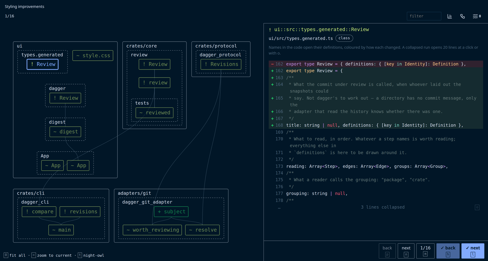

# `dagger`

## code review optimized for the human brain

LLMs write code faster than humans can understand it, but humanity ain't going down without a fight.



But we need better code review tools if we want to win.

`dagger` analyzes code changes and creates a review path that maximizes understanding while minimizing cognitive load.

## Install

```
curl -fsSL https://github.com/joshmoody24/dagger/releases/latest/download/dagger-installer.sh | sh
```

That puts one static binary in `~/.local/bin`. Linux and macOS.

`dagger` natively supports git, Rust, and TypeScript, but can easily be extended to work with other version control systems or languages. Rust and TypeScript are read through their language servers, installed the same way you would for an editor:

- Rust: `rustup component add rust-analyzer`
- TypeScript: `npm install -g typescript` (version 7 or later, which provides `tsc --lsp`)

## Use

From inside a repository:

```sh
dagger gui # working tree
dagger gui commits A B
dagger gui branch my-branch
```

Every command is `dagger <output> <what to review>`. The output is one of:

```sh
dagger gui
dagger cli
dagger json
dagger md
```

## Configuration

Without a `dagger.toml`, `dagger` infers everything from the repository. A `dagger.toml` at the repository root overrides the inferred configuration. Every supported setting:

```toml
[snapshots]
adapter = "git"
settings = { trunk = "origin/main", carry_ignored = true }

[[extractors]]
adapter = "rust"
include = ["**/*.rs"]
settings = { linked = ["tools/Cargo.toml"] }

[[extractors]]
adapter = "lsp"
include = ["**/*.ts", "**/*.tsx"]
settings = { server = ["tsc", "--lsp", "--stdio"] }

[group]
name = "package"
markers = ["Cargo.toml", "package.json"]

[review]
ignore = ["Cargo.lock"]
ripples = 1
```

- `[snapshots]`: how revisions are laid out on disk
  - `adapter`: `git` is built in
  - `settings.trunk` (`git`): what a branch is compared against. Defaults to the remote's default branch.
  - `settings.carry_ignored` (`git`): link ignored files (build output, installed packages) into each snapshot so language servers can resolve imports. Default true.
- `[[extractors]]`: the extractor adapters that read the code, one per language
  - `adapter`: `rust` and `lsp` are built in
  - `include`: globs assigning files to this extractor adapter. A file matched by two is assigned to the later one. Files assigned to none are compared whole.
  - `settings.server` (`lsp`): the language server command
  - `settings.options` (`lsp`): passed to the server as its initialization options
  - `settings.linked` (`rust`): extra Cargo manifests outside the workspace
- `[group]`: how definitions are grouped. Each group is drawn as a box on the graph.
  - `name`: what a group is called
  - `markers`: files whose directory is a group. A definition belongs to the nearest marker above its file. Groups do not nest.
- `[review]`
  - `ignore`: files left out entirely
  - `ripples`: how many steps outward from a change to follow what it affects. Each step asks the language server about every definition reached so far, so on a large repository 0 keeps a review fast. `--ripples` on the command line overrides it.

## Supporting another language

If the language has a language server, supporting it is one extractor adapter entry:

```toml
[[extractors]]
adapter = "lsp"
include = ["**/*.py"]
settings = { server = ["pyright-langserver", "--stdio"] }
```

If the language does not have a language server, or the server's symbols aren't good enough, an extractor adapter is any program that answers `dagger`'s JSON requests on stdin with responses on stdout: what's defined in a file, split into contract, body and docs, and what each definition mentions. The built-in `rust` adapter is one such program: a parser of its own for definitions, with rust-analyzer for references. The requests and responses are in `crates/protocol`, and the vocabulary is in [docs/model.md](docs/model.md).

```toml
[[extractors]]
adapter = "./tools/dagger-python"
include = ["**/*.py"]
```

A path with a slash is relative to the repository. A bare name comes off `PATH`. A `[snapshots]` adapter is named the same way, for a version control system other than git.

## Developing

You need stable Rust, Node 22, and the two language servers from Install. With nix, `nix develop` installs all four.

```sh
npm --prefix ui ci
./build
./check
```
