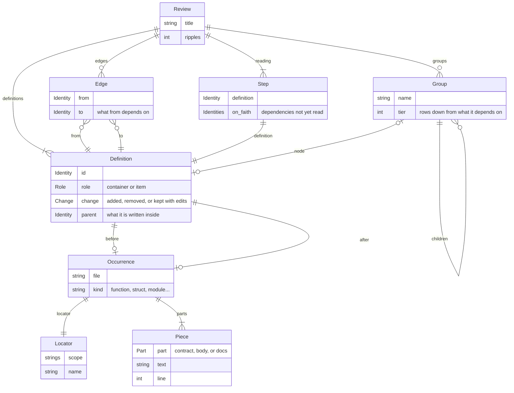

# Dagger's data model

This is the vocabulary dagger uses and how the words relate. The Rust types in
`crates/core/src` are the source of truth.

## A review, end to end

A review is one reading of the difference between two code snapshots. Each word below is
defined where the tool first produces the thing it names.

1. A **snapshot** is one version of the code, laid out on disk. The snapshot adapter turns
   what the user asked for (`main...HEAD`, or nothing) into two snapshots, **before** and
   **after**.
2. In each snapshot, the extractors read the files they claim. For every named thing in a
   file they report an **occurrence**: where it is (a **locator**, the file and a path of
   names) and what it is made of. What it is made of is a list of **pieces**, each a stretch
   of text that belongs to one **part**: the **contract**, which callers can see; the
   **body**, which they can't; or the **docs**. Beside the occurrences, the extractors
   report **mentions**: places where one occurrence names another.
3. The core matches the occurrences of the two snapshots. An occurrence in the before
   snapshot and one in the after snapshot that are the same named thing become one
   **definition**, given an **identity**. A definition with an occurrence in only one snapshot
   is added or removed; one with both is kept, and its **change** says which parts differ.
4. Mentions become **references** between definitions, and the core follows them outward
   from what changed, as many steps as the **ripples** setting allows, to find what a change
   **reached**. The references among the definitions shown become **edges**: what depends
   on what.
5. The core decides the **reading**: a list of **steps**, one definition each, in the order
   to read them, nothing before what it depends on.
6. The core shapes the definitions into **groups**, the boxes on the page, each with a
   **tier**: how many rows down from what it depends on it sits.
7. The page in the browser, or the terminal, renders that one **review** and decides
   nothing else.

## The core model

A `Review` is what one reading of a change comes to. Everything hangs off its definitions.

A definition has an occurrence in the before snapshot, the after snapshot, or both. Groups nest: a group from `[group]` in `dagger.toml` holds the definitions in it, and a definition that holds others, like a module, is a group of its own with a node for itself when it is read.

## Glossary

- **adapter**: any executable dagger talks to over JSON: a snapshot adapter or an extractor. Named in `dagger.toml` by `Adapter` / `Extractor`.
- **before / after**: the two snapshots being compared, and which snapshot anything that spans them was seen in (`Sides::Kept`, `Reference::before` / `after`).
- **body**: the `Part` that is internal; changing it can't break callers.
- **change**: what happened to one definition between the snapshots: `Change::Added`, `Removed`, or `Kept(Edits)`. Held on `review::Definition`.
- **contract**: the `Type` part, what callers see, including the name. `Occurrence::contract` is the compiler's own view of it and, when present in both snapshots, overrides the written text for deciding whether callers broke. `Edits::contract` says it changed.
- **definition**: one named thing in the source. `model::Definition` is its two occurrences under one identity; `review::Definition` is everything the review knows about it.
- **docs**: the `Part` written for callers that can't break them.
- **edge**: one shown definition depending on another (`Edge { from, to }`), with unshown definitions stepped over. Held on `Review::edges`.
- **extractor**: an adapter that reads one snapshot and reports an `Extraction`: occurrences and mentions for the files it claims.
- **group**: one box on the page (`Group::Group`, with a name, tier and children) or one thing in it (`Group::Node`). Boxes come from the grouping and from containers. Held on `Review::groups`.
- **grouping**: the one way of boxing definitions in use, like "package" or "crate": a name and each identity's path (`Grouping`). Configured by `[group]` in `dagger.toml`.
- **identity**: the number matching hands a definition so both snapshots share it (`Identity`). Means nothing on its own.
- **locator**: where a definition lives in one snapshot: scope plus name (`Locator`). The name is kept apart because renaming breaks callers and moving doesn't.
- **mention**: one spot where a definition mentions another in a single snapshot (`Mention { from, to, site }`), as far as an extractor can get.
- **occurrence**: a definition as it exists in one snapshot (`Occurrence`): locator, role, parent, kind, file, parts, contract.
- **on faith**: a dependency read after the thing that depends on it, which only happens in a cycle. Listed per `Step::on_faith`, counted in `Cost::taken_on_faith`.
- **open**: a definition already read while something unread still depends on it. Counted in `Cost::peak_open` and `total_open`.
- **part**: one of the pieces a definition's text is split into: `Type`, `Body`, `Docs` (`Part`). A part can be missing when it doesn't apply.
- **piece**: one stretch of source belonging to a part (`Piece`: text, span, line, file). A part is a list of these because its source isn't always contiguous.
- **reached**: hops from the nearest change that reached a definition through references (`review::Definition::reached`). Never zero: its own change is `change`.
- **reading**: what to read, in order (`Review::reading`, a list of steps). Whatever a step names is worth reading; everything else is drawn around it.
- **ripples**: how far a change is followed outward through references, in hops (`Review::ripples`, `Request::Extract::ripples`, `ReviewConfig::ripples`).
- **role**: whether a definition can hold others: `Item` reads on its own; `Container` can hold others and is drawn as a box (`Role`). Said by the extractor.
- **sides**: which snapshots a definition showed up in (`Sides`): `Added`, `Removed`, or `Kept { before, after }`.
- **site**: one spot in the source where a mention sits: part, span, and which binder found it (`Site`).
- **snapshot**: one version of the code, laid out on disk by the snapshot adapter, which answers `Resolve` and `Materialize`.
- **step**: one entry in the reading: a definition plus what it was taken on faith about (`Step`).
- **target**: what a mention or reference points at: `Known(T)` or `Unknown { symbol }` when nothing could bind it (`Target`).
- **tier**: a group's or node's depth among its siblings: zero if it depends on nothing else in its holder, else one more than its deepest dependency. Held on `Group`.
- **warning**: a reason the review might be wrong, worded for the reader (`Warning`: impact, message, about). Adapter notes and dagger's own diagnostics share the list. `Impact::Incomplete` means something may be missing; `Degraded` means it's shown but from worse information.

## Where each thing is decided

- **Snapshot adapter**: which two snapshots are compared, what they're called, and where each sits on disk.
- **Extractors**: what counts as a definition, how its text splits into parts and pieces, its role and parent, and every mention. Only they know the line numbers and the compiler's contract.
- **Core, matching**: which occurrences in the two snapshots are the same definition. Hands out identities and turns mentions into references.
- **Core, classification and propagation**: what changed about each definition and whether it breaks callers; how far a change reaches through references, up to the ripple depth.
- **Core, ordering and shape**: the reading order and its cost; how groups nest and which tier each sits on. Decided once so the reading and the page can't disagree.
- **Page and terminal**: pixels only. They draw the `Review` and decide nothing about it.
