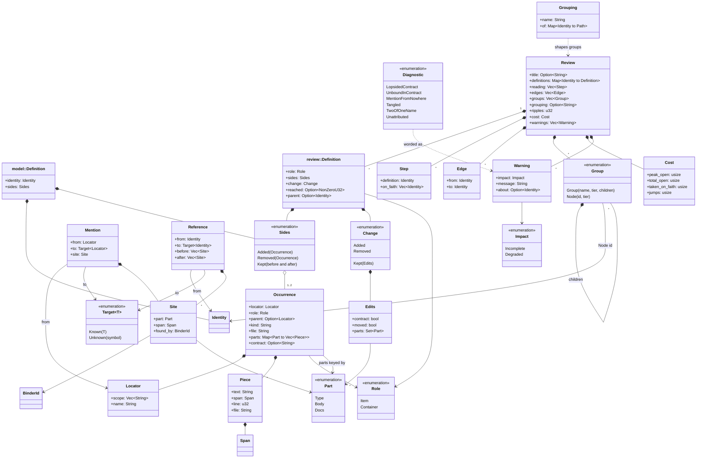
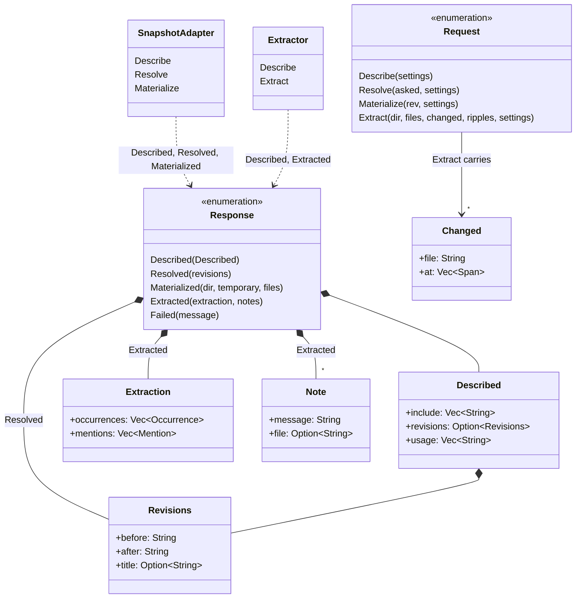

# Dagger's data model

This is the vocabulary dagger uses and how the words relate. The Rust types in
`crates/core/src` are the source of truth; this page is the map.

## A review, end to end

A review is one reading of a change to a repository. The snapshot adapter turns what the
user asked for (`main...HEAD`, or nothing) into two revisions and lays each one out on
disk. For each side, the extractors read the files they claim and report what's defined
there (occurrences, split into parts) and where one definition mentions another
(mentions). The core matches the two sides so each definition gets one identity across
both snapshots, classifies what happened to it (added, removed, or kept with edits),
follows references outward from what changed as far as the ripple depth allows, decides
the order to read the result in, and shapes everything into nested groups with tiers.
The page in the browser, or the terminal, renders that one `Review` object and decides
nothing else.

## The core model

`Definition` names two types: `model::Definition` is the matched pair of occurrences
handed to the core; `review::Definition` is what the review keeps about one (sides,
change, reached, parent). `order()` returns `Ordering { steps, cost }`, which the review
carries as `reading` and `cost`. `Span` is `start`/`end` byte offsets; `Identity` and
`BinderId` wrap a number and a string.

## The adapter protocol

An adapter is any executable: one JSON request on stdin, one JSON response on stdout,
stderr reaches the user. A snapshot adapter answers Describe, Resolve and Materialize.
An extractor answers Describe and Extract.

An adapter may also write `Progress` lines to stderr (`StartingServer`, `Indexing`,
`Walked`, `Finished`), a fixed vocabulary so wording matches across adapters.

`dagger.toml` names the adapters. `Config` holds one `snapshots: Adapter` (command, args,
settings), a list of `extractors: Extractor` (the same plus `include` globs; the last
listed wins a contested file), one `grouping: GroupingConfig` (a name like "package" and
marker files like `Cargo.toml`), and `review: ReviewConfig` (`ignore` globs, default
`ripples`). Without a `dagger.toml`, git and the visible languages are inferred.

## Glossary

- **adapter**: any executable dagger talks to over JSON: a snapshot adapter or an extractor. Named in `dagger.toml` by `Adapter` / `Extractor`.
- **before / after**: the two snapshots being compared, and the two sides of anything that spans them (`Sides::Kept`, `Reference::before` / `after`, `Revisions`).
- **body**: the `Part` that is internal; changing it can't break callers.
- **change**: what happened to one definition between the snapshots: `Change::Added`, `Removed`, or `Kept(Edits)`. Held on `review::Definition`.
- **contract**: the `Type` part, what callers see, including the name. `Occurrence::contract` is the compiler's own view of it and, when present on both sides, overrides the written text for deciding whether callers broke. `Edits::contract` says it changed.
- **definition**: one named thing in the source. `model::Definition` is its two occurrences under one identity; `review::Definition` is everything the review knows about it.
- **docs**: the `Part` written for callers that can't break them.
- **edge**: one shown definition depending on another (`Edge { from, to }`), with unshown definitions stepped over. Held on `Review::edges`.
- **extractor**: an adapter that reads one snapshot and reports an `Extraction`: occurrences and mentions for the files it claims.
- **group**: one box on the page (`Group::Group`, with a name, tier and children) or one thing in it (`Group::Node`). Boxes come from the grouping and from containers. Held on `Review::groups`.
- **grouping**: the one way of boxing definitions in use, like "package" or "crate": a name and each identity's path (`Grouping`). Configured by `GroupingConfig`.
- **identity**: the number matching hands a definition so both sides share it (`Identity`). Means nothing on its own.
- **locator**: where a definition lives in one snapshot: scope plus name (`Locator`). The name is kept apart because renaming breaks callers and moving doesn't.
- **mention**: one spot where a definition mentions another in a single snapshot (`Mention { from, to, site }`), as far as an extractor can get.
- **occurrence**: a definition as it exists in one snapshot (`Occurrence`): locator, role, parent, kind, file, parts, contract.
- **on faith**: a dependency read after the thing that depends on it, which only happens in a cycle. Listed per `Step::on_faith`, counted in `Cost::taken_on_faith`.
- **open**: a definition already read while something unread still depends on it. Counted in `Cost::peak_open` and `total_open`.
- **part**: one of the pieces a definition's text is split into: `Type`, `Body`, `Docs` (`Part`). A part can be missing when it doesn't apply.
- **piece**: one stretch of source belonging to a part (`Piece`: text, span, line, file). A part is a list of these because its source isn't always contiguous.
- **reached**: hops from the nearest change that reached a definition through references (`review::Definition::reached`). Never zero: its own change is `change`.
- **reading**: what to read, in order (`Review::reading`, a list of steps). Whatever a step names is worth reading; everything else is drawn around it.
- **ripples**: how far a change is followed outward through references, in hops (`Review::ripples`, `Request::Extract::ripples`, `ReviewConfig::ripples`).
- **role**: whether a definition can hold others: `Item` reads on its own; `Container` can hold others and is drawn as a box (`Role`). Said by the extractor.
- **side**: one of the two snapshots. `Sides` says which a definition showed up in: `Added`, `Removed`, or `Kept { before, after }`.
- **site**: one spot in the source where a mention sits: part, span, and which binder found it (`Site`).
- **snapshot**: one revision laid out on disk by the snapshot adapter, which answers `Resolve` and `Materialize`.
- **step**: one entry in the reading: a definition plus what it was taken on faith about (`Step`).
- **target**: what a mention or reference points at: `Known(T)` or `Unknown { symbol }` when nothing could bind it (`Target`).
- **tier**: a group's or node's depth among its siblings: zero if it depends on nothing else in its holder, else one more than its deepest dependency. Held on `Group`.
- **warning**: a reason the review might be wrong, worded for the reader (`Warning`: impact, message, about). Adapter notes and dagger's own diagnostics share the list. `Impact::Incomplete` means something may be missing; `Degraded` means it's shown but from worse information.

## Where each thing is decided

- **Snapshot adapter**: which two revisions are compared, what they're called, and where each sits on disk.
- **Extractors**: what counts as a definition, how its text splits into parts and pieces, its role and parent, and every mention. Only they know the line numbers and the compiler's contract.
- **Core, matching**: which occurrences on the two sides are the same definition; hands out identities and turns mentions into references.
- **Core, classification and propagation**: what changed about each definition and whether it breaks callers; how far a change reaches through references, up to the ripple depth.
- **Core, ordering and shape**: the reading order and its cost; how groups nest and which tier each sits on. Decided once so the reading and the page can't disagree.
- **Page and terminal**: pixels only. They draw the `Review` and decide nothing about it.
